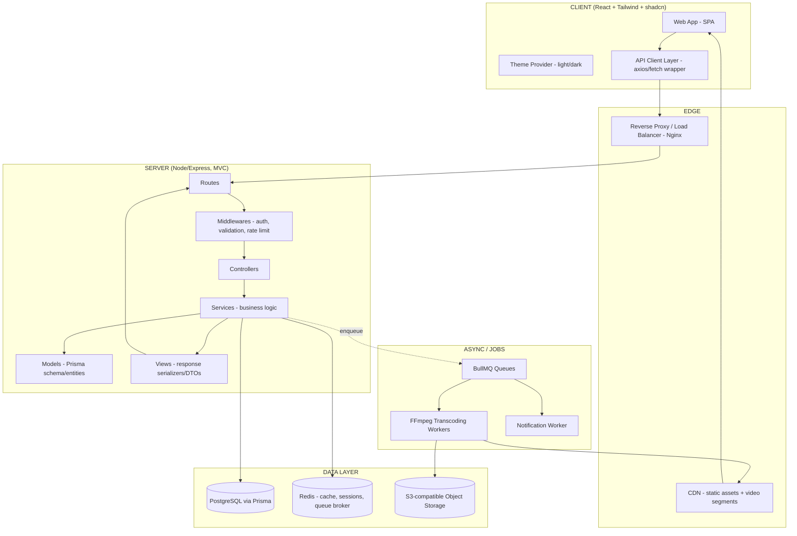

# Architecture — StreamCM

This document defines the system architecture for the current stack: **React (Vite) + Tailwind + shadcn/ui** frontend, **Node.js/Express** backend, **PostgreSQL** (via Prisma) database. Client-server architecture, MVC pattern on the backend.

Read alongside `file-structure.md`, which is the literal folder implementation of everything described here.

---

## 1. High-Level Diagram



---

## 2. Client Architecture (React)

The frontend is a single-page application. Structure follows a **feature-based** organization (not just type-based) so agents can find everything related to one feature (e.g., "video-upload") in one place.

Key layers:
- **`pages/`** — route-level components, composed from features.
- **`features/`** — self-contained feature modules (e.g. `auth`, `catalog`, `player`, `creator-studio`, `billing`). Each feature owns its own components, hooks, and API calls.
- **`components/ui/`** — shadcn primitives, untouched or minimally themed (buttons, dialogs, inputs).
- **`components/shared/`** — cross-feature composite components (navbar, video card, theme toggle).
- **`context/`** — React context providers: `ThemeContext`, `AuthContext`.
- **`lib/`** — utilities, the API client wrapper, query client config (TanStack Query recommended for server state).
- **`store/`** — global client state (Zustand recommended — lighter than Redux for this scope).

**State management split:**
- Server state (catalog data, user profile, video metadata) → TanStack Query (React Query).
- Client-only UI state (theme, modals, upload progress) → Zustand or Context, kept minimal.

**Theming**: implemented via CSS variables + Tailwind's `dark:` variant, toggled through a `ThemeContext`. Full detail in `ui-context.md` — that file is authoritative for all color/theme decisions.

---

## 3. Server Architecture (Node/Express, MVC)

Every backend module follows the same internal shape:

```
routes → middlewares → controllers → services → models (Prisma) → services → views (serializer) → response
```

| Layer | Responsibility | Must NOT do |
|---|---|---|
| **Routes** | Map HTTP verb + path to controller function | Contain any logic |
| **Middlewares** | Auth guard, input validation (zod/Joi), rate limiting, error handling | Touch the database directly |
| **Controllers** | Parse request, call service, return response via a view/serializer | Contain business logic or direct DB queries |
| **Services** | All business logic, orchestration, calls to Prisma, calls to external APIs (Flutterwave, S3, BullMQ) | Know about `req`/`res` — services must be framework-agnostic |
| **Models** | Prisma schema definitions, DB access only | Contain business logic |
| **Views** | Shape the JSON returned to the client (DTOs) — hide internal fields (e.g. storage paths, internal flags) | Contain logic beyond formatting |

This separation matters most for testability: services should be unit-testable without spinning up Express at all.

### Module list (backend domains)
- `auth` — registration, login, OTP, JWT issuing/refresh
- `users` — profile, roles, settings
- `catalog` — movies/series/videos metadata, categories
- `uploads` — chunked/resumable upload handling, pre-processing
- `transcoding` — job orchestration (actual FFmpeg work happens in a worker process, not inline in the API)
- `playback` — signed URL generation, HLS manifest serving, resume position tracking
- `billing` — subscriptions, pay-per-view, Flutterwave webhook handling
- `notifications` — push/SMS/email dispatch
- `moderation` — content review queue, flagging
- `analytics` — watch-time and event tracking ingestion

Each of these becomes its own folder under `server/src/` — see `file-structure.md`.

---

## 4. Video Pipeline (async, queue-driven)

1. Client uploads video in chunks (resumable — critical for unreliable connections) → `uploads` module streams to a temp location, then to object storage.
2. On upload completion, `uploads` service creates a `Video` record with `status: PROCESSING` and enqueues a `transcode` job in BullMQ.
3. A separate **worker process** (not the API server) picks up the job, runs FFmpeg, produces HLS renditions (240p–1080p), uploads outputs to object storage, generates thumbnails.
4. Worker updates `Video.status = READY` and emits a `notification` job (creator gets notified their video is live).
5. CDN serves the HLS manifest + segments directly from object storage/CDN — the API server never proxies video bytes.

**Why a separate worker process**: transcoding is CPU-bound and long-running. Running it inline in the Express process would block the event loop and tank API responsiveness under load. Workers scale independently (horizontally, or on separate compute optimized for CPU/GPU work).

---

## 5. Data Layer

| Store | Used for |
|---|---|
| PostgreSQL (Prisma) | Users, roles, catalog metadata, subscriptions, billing records, moderation records |
| Redis | Session/token blacklist, rate limiting, BullMQ broker, hot-catalog cache |
| S3-compatible storage | Raw uploads, transcoded HLS renditions, thumbnails |

**Prisma schema domains** (high level — refine as build progresses):
`User`, `Role`, `Video`, `Category`, `WatchHistory`, `Subscription`, `Transaction`, `Notification`, `ModerationFlag`.

---

## 6. Auth & Security

- JWT access token (short-lived) + refresh token (httpOnly cookie).
- Role-based middleware (`requireRole('creator')`, `requireRole('admin')`).
- Signed, time-limited URLs for video segment access (prevent hotlinking of paid content).
- Input validation on every controller boundary (zod schemas colocated with each module).
- Rate limiting on auth and upload endpoints specifically (abuse-prone).

---

## 7. API Style

- REST, versioned under `/api/v1/`.
- JSON:API-lite convention: consistent envelope `{ data, meta, error }`.
- Errors follow a standard shape: `{ error: { code, message, details? } }` — defined once in a shared middleware, never ad-hoc per controller.

---

## 8. Deployment Shape (conceptual, not prescriptive yet)

- `client` → static build served via CDN/Nginx.
- `server` (API) → containerized, horizontally scalable, stateless.
- `worker` (transcoding/notifications) → separate containerized process, scaled independently based on queue depth.
- `postgres`, `redis` → managed services where possible.

---

## 9. Explicit Non-Decisions (for now)

- **No microservices split yet.** The module boundaries above (auth, catalog, uploads, etc.) are enforced as separate folders/packages within one Express app, so that splitting them into real services later is a lift-and-shift, not a rewrite.
- **No GraphQL in MVP** — REST is simpler for agents to generate consistently and simpler to secure.
- **No Kafka** — BullMQ/Redis is sufficient at this scale and much simpler to operate for a small team.

Any change to these non-decisions should be reflected here and in `progress-tracker.md`, not decided ad hoc mid-implementation.